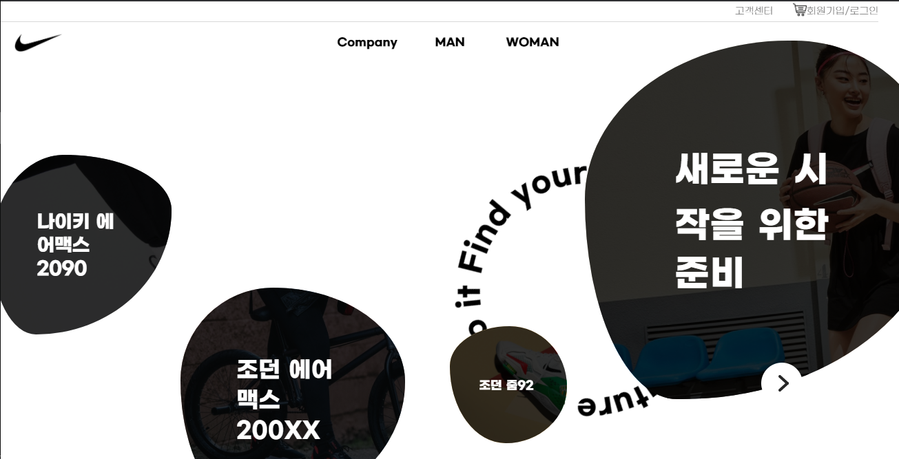
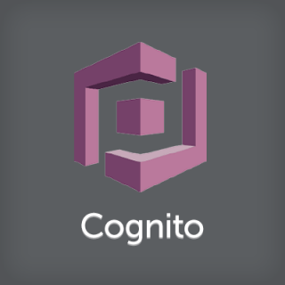
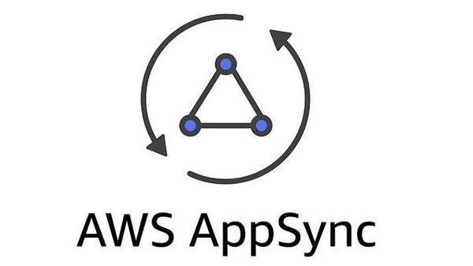

# NIKE Modern Web

  

## 프로젝트 소개

AWS S3와 APPSYNC 를 활용해서 만든 리액트 프로젝트입니다. 직접만든 상품정보(JSON 형식)을 활용하여 상품을 검색하고 찾아보며, 상품의 상세 정보를 확인하고, 장바구니에 담아 결제할 수 있게 구성했습니다.

 

## 웹사이트 화면
GS 칼텍스 사이트 디자인 + Nike 사이트 디자인

|             홈              |           상품정보            |
| :-------------------------: | :---------------------------: |
|  |  |

|           상품상세            |            장바구니            |
| :---------------------------: | :--------------------------: |
|  |  |

 

## 기술 스택

|               UI 라이브러리                |                      라우팅                       |                  상태관리                  |                비동기 상태 관리                 |
| :----------------------------------------: | :-----------------------------------------------: | :----------------------------------------: | :---------------------------------------------: |
|  |  |  |  |

|                        스타일링                        |             테스팅 프레임워크             |                         DOM 테스팅                          |                   자격 증명                    |
| :----------------------------------------------------: | :---------------------------------------: | :---------------------------------------------------------: | :--------------------------------------------: |
|  |  |  |  |

|                프로토타이핑                 |                 데이터 관리                 |
| :-----------------------------------------: | :---------------------------------------: |
|  |  |

 

## 프로토타이핑

프로젝트를 시작하기전, 제일 먼저 **Figma** 를 사용하여 전체적인 프로토타이핑을 하였습니다. Web-first로 진행할 것이었기 때문에 데스크탑 화면에서 모바일 화면 순으로 만들어나갔습니다. 프로토 타이핑을 처음 시도해서 미숙한 점이 많았지만, 확실히 프로토타이핑을 사용해 틀을 잡고 시작하니 중복요소를 빠르게 파악하고 코드를 최소화하는데 시간을 최소화 할 수 있었습니다. 

 

## 프로젝트를 통해 배운 것들

* Redux를 사용해서 상태관리를 하는 방법
* Redux-Saga를 사용해서 비동기로 변하는 상태관리를 하는 방법
* Styeld components를 사용해서 각 컴포넌트를 CSS-in-JS 방식으로 스타일링 하는 방법
* React testing library를 사용해서 DOM을 테스트하는 방법
* 오픈 API와 axios를 사용해서 데이터를 가져오는 방법
* LocalStorage를 사용하는 방법
